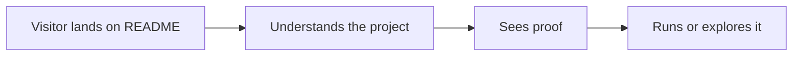
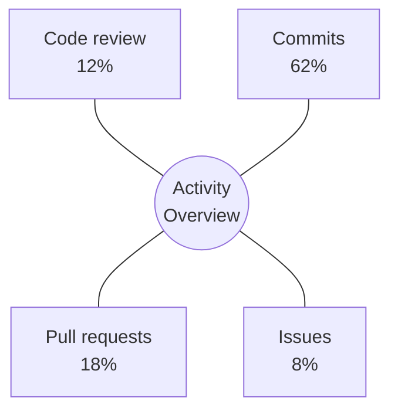

<!--
Default README template.
Replace the sample names, links, and numbers with real project facts.
Remove sections that do not match the repository.
-->

<div align="center">
  <!-- Optional for product-like repos:  -->
  <h1>Project Name</h1>
  <p><strong>A clear one-sentence promise for the project.</strong></p>
  <p>Who it is for · What it helps them do · Why it is worth trying</p>

  <p>
    <a href="https://example.com">Live Demo</a>
    ·
    <a href="./docs">Docs</a>
    ·
    <a href="./examples">Examples</a>
    ·
    <a href="./CHANGELOG.md">Changelog</a>
  </p>

  <p>
    
    
    
  </p>
</div>

---



## Why This Exists

- The target user has a real problem that the project solves.
- The project offers a simpler path than the current workflow.
- The README gives enough proof to try it without reading the whole codebase.

## Highlights

| Area | What It Does | Why It Matters |
| --- | --- | --- |
| First value | Explains the core outcome quickly | Reduces bounce in the first screen |
| Proof | Shows screenshots, diagrams, or examples | Makes the project feel real |
| Path | Gives install, usage, and next steps | Turns interest into action |

## Quick Start

```bash
git clone https://github.com/owner/repo.git
cd repo
make dev
```

## Usage

```bash
project-name run ./examples/input.json
```

Expected result:

```text
Output is generated in ./dist with a readable report and logs.
```

## Project Structure

```text
repo/
├─ docs/        Documentation and design notes
├─ examples/    Small runnable examples
├─ src/         Core implementation
├─ tests/       Regression tests
└─ README.md
```

## Roadmap

| Stage | Status | Scope |
| --- | --- | --- |
| v0.1 | Done | Core workflow and examples |
| v0.2 | Doing | Better docs and public demo |
| v0.3 | Planned | Integrations, templates, and benchmarks |

## Star History

[](https://star-history.com/#owner/repo&Date)

## Activity Overview

Use this only when contribution mix matters. Keep the numbers honest.



## Contributing

Issues and pull requests are welcome. For large changes, open an issue first so the direction is clear.

## License

MIT
