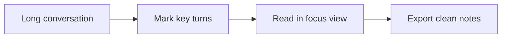

<!-- Product/app README template. Replace the sample product with your own. -->

<div align="center">
  
  <h1>FlowBoard</h1>
  <p><strong>A focused workspace for turning scattered AI chats into reusable project notes.</strong></p>
  <p>Browser extension · Markdown export · Built for long research sessions</p>
  <p>
    <a href="https://example.com">Try Demo</a>
    ·
    <a href="./docs">Docs</a>
    ·
    <a href="./CHANGELOG.md">Changelog</a>
  </p>
  <p>
    
    
    
  </p>
</div>

## Product Preview

| Conversation Navigator | Focus View | Export |
| --- | --- | --- |
| Jump between important turns | Read without losing context | Save Markdown, PDF, or PNG |



## What You Can Do

- Build a right-side conversation index for long AI sessions.
- Save important turns as reusable bookmarks.
- Copy clean Markdown without UI noise.
- Export polished notes for sharing or archiving.

## Quick Start

```bash
npm install
npm run dev
```

## Screenshots To Add

- `assets/screenshot-navigator.png`
- `assets/screenshot-reader.png`
- `assets/screenshot-export.png`

## Roadmap

- [ ] Better keyboard navigation
- [ ] Workspace-level bookmark folders
- [ ] Export presets for blogs and knowledge bases
